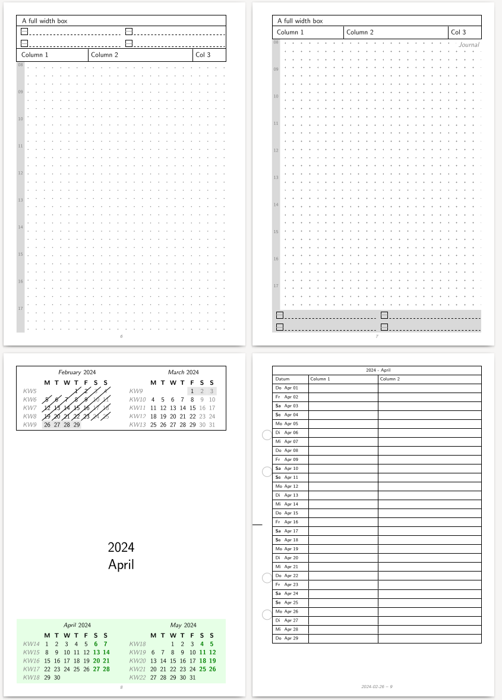

# Notebook: A PGF/TikZ LaTeX Package for Custom Note-taking Templates

Notebook is a versatile PGF/TikZ package designed for creating custom
templates for handwritten note-taking and journaling. It combines the
precision of LaTeX with the organic feel of handwritten notes,
offering a bridge between structured digital planning and the freeform
nature of pen and paper. With Notebook, users can design pages
tailored to their specific needs, from simple lined pages for
traditional note-taking to more complex layouts with to-do lists,
tables, and calendars for comprehensive planning and organization.

## Features

- **Page Styles**: Choose from dotted, lined, or squared page fills to suit different writing and drawing preferences.
- **Customizable Elements**: Insert customizable full-width boxes for headings, summaries, or important notes.
  - **To-Do Lists**: Add to-do lists with customizable positioning and fill options.
  - **Column Layouts**: Organize content with flexible column layouts for side-by-side comparisons or segmented information.
  - **Calendars**: Embed monthly calendars with options to highlight specific weeks, weekends, or dates, aiding in long-term planning and event tracking.
- **Pagination**: Automatically number pages for easy reference and organization.
- **Styling Options**: Extensive customization options, including fold marks and punch marks for physical binder compatibility.
- **Power of TikZ**: As the package is build upon tikz, you have endless options to customize your paper.

## Screenshots



## Usage Examples

The file `example.pdf` contains the result of these examples. `example.tex` is the compilable version.

1. **Basic Page Styles**:

   Create simple note-taking templates with different backgrounds:
   ```latex
   \notebookpage{fill dotted,paginate}
   \notebookpage{fill squares,paginate}
   \notebookpage{fill lines,paginate}
   \notebookpage{fill crosses,paginate}
   ```

2. **Advanced Layouts**:

   Combine various elements for a more structured approach:
   ```latex
   \notebookpage{
     box={A full width box},
     todo=2,
     columns={Column 1/2,Column 2/3,Col 3/1},
     fill dotted, paginate
   }
   ```

   For journaling or detailed planning with added visual elements:
   ```latex
   \notebookpage{
     box={A full width box},
     todo={[bottom,fill=gray!30]2},
     columns={Column 1/2,Column 2/3,Col 3/1},
     fill crosses, time codes,paginate,
     label={north east}{Journal},
   }
   ```

3. **Calendar Integration**:

   Embed and customize calendars within your templates:
   ```latex
   \pgfcalendarcalc{\year-\month-\day}{\ThisDay}
   \pgfcalendarcalc{\year-\month-last+1}{\NextMonth}
   \pgfcalendarcalc{\Y-\M-last+1}{\NextMonth}

   \notebookpage{
     calendar=\ThisDay,
     fill elem={
       [label={[align=center,font={\Huge}]
         center:\Y\\\pgfcalendarmonthname{\M}}]
     },
     calendar/next week/.style={},
     calendar/gone/.style={},
     calendar/weekend/.style={green!50!black,font=\bfseries},
     calendar={[bottom,fill=green!10]{\NextMonth}},
     paginate,
   }
   ```
   
   Instead of a calendar block, you can also print a line for every day of the month:
   
   ```latex
   \pgfcalendarcalc{\year-\month-\day}{\ThisDay}
   \notebookpage{
       month list={\ThisDay}{Column 1/2,Column 2/3},
       paginate={\ThisDay{} -- \thepage}
   }
   ```

4. **Custom Canvas Settings**:

   Apply specific canvas styles for enhanced functionality:
   ```latex
   \nbkeys{
     every canvas/.style={/notebook/.cd, foldmark,punchmarks={65mm/2,110mm/2}} 
   }
   \notebookpage{fill dotted}
   ```

## Getting Started

To begin using the Notebook package in your LaTeX documents, simply
include it with `\usepackage{tikz} \usetikzlibrary{notebook}` in your
LaTeX preamble. Customize your pages using the `\notebookpage{}`
command with your desired options and styles. Explore different
combinations of features to create the perfect template for your
note-taking and journaling needs.

## Hardware Recommendations

- For my physical binder, I use a [FlexiNotes](https://www.flexinotes.de) notebook, which I can highly recommend.

- For my handwriting, I use a **Lamy logo** fountain pen with the extra fine tip. The pen looks elegant and takes up those large Lamy ink cartridges.

- Do never ask me about 4-hole perforators for DIN A5 paper...
